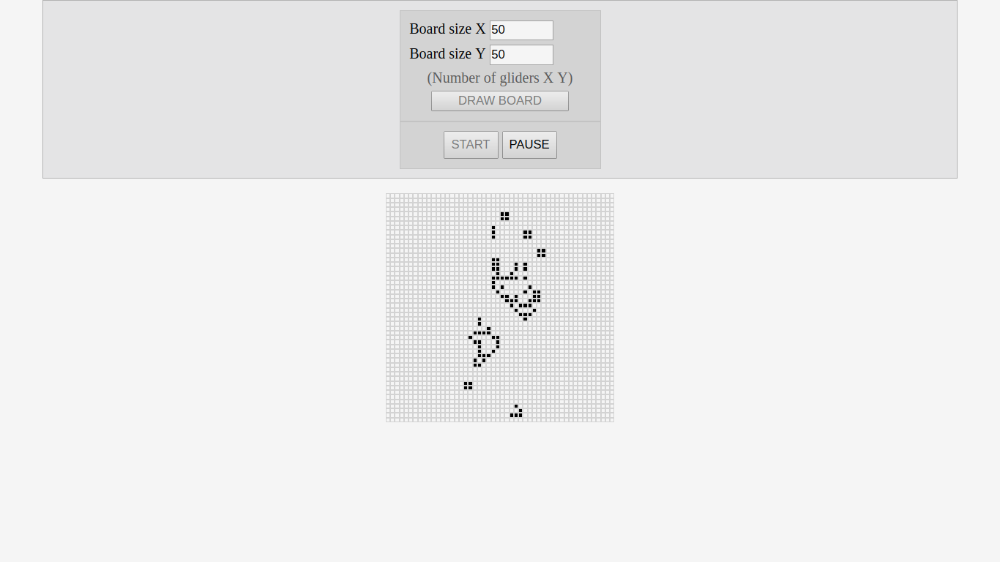

# Conway's Game of Life
My execution of Conway's Game of Life in JavaScript environment. Application can be started directly from github pages,
just click the link below.

https://kamilpszczolkowski.github.io/Game-of-Life/

# Purpose and technology

I created this application to practice skills of object oriented programming and general JavaScript programming. I didn't
focus mostly on optimisation - rather on creating and managing objects in my code.

Application is written in JavaScript. Css code is compiled from sass files by Gulp packages. I used also Gulp to
create localhost server, which allowed mi to se the differences after saving the files.

# Description

THe Game of Life is a cellular automation created by John Horton Conway. It's a zero-player game - the effect of the game
is determined only by game initial state. On the beginning user sets, which cells are alive and starts the animation. In
iterations number of alive neighbours is calculated for every cell and, basing on it - the cell dies or lives in next iteration. You can
read full description on the link below.

https://en.wikipedia.org/wiki/Conway%27s_Game_of_Life

Steps of my algorithm:
*   user specifies the size of the board (number of gliders in X and Y dimensions),
*   the board is drawn by clicking the button "DRAW BOARD",
*   user clicks on cells which should be alive at the beginning (alive cells becomes black after clicking),
*   user starts animation by clicking "START" button,
*   animation may be paused by using "PAUSE" button, user can change the state of game and start it again.

I added another functionality - when the cell is on the edge of the map, neighbours are taken from the opposite sites of
the board. 

